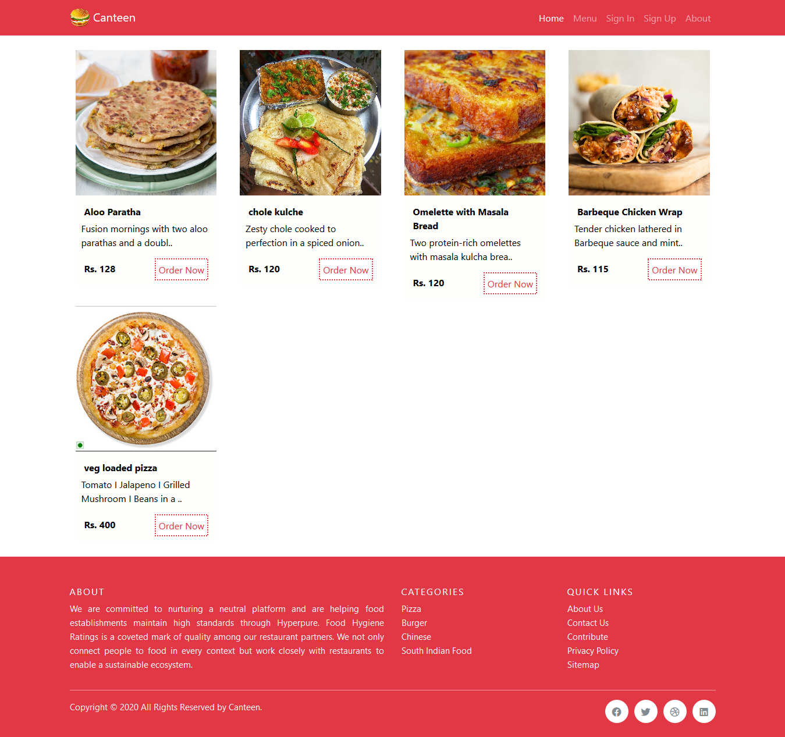

# About
Zomato Looking fully modern user friendly website.

## Technology

* HTML
* CSS
* Javascript
* Bootstrap
* Phpmyadmin
* Some Exteral Library

Screenshots
----
Home Screen



Dashboard


## Usage
Preferably, you can download this site by cloning the Git repository:
```
git clone https://github.com/heythisisvivek/Canteen.git
```

Links
----

* Homepage: https://thisisvivek.ninja
* Twitter: [@heythisisvivek](https://twitter.com/heythisisvivek)
* Telegram: [@heythisisvivek](https://t.me/heythisisvivek)

## Contributing
Pull requests are welcome. For major changes, please open an issue first to discuss what you would like to change.

Please make sure to update tests as appropriate.